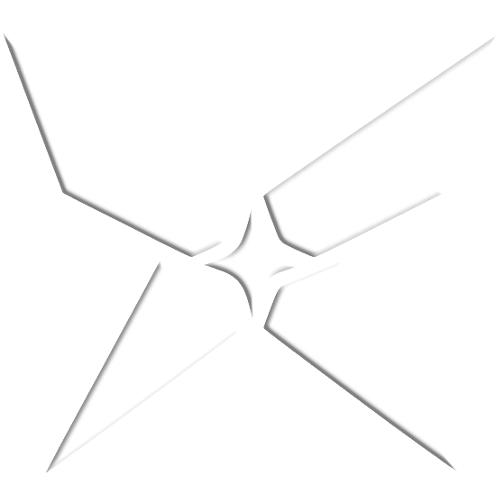
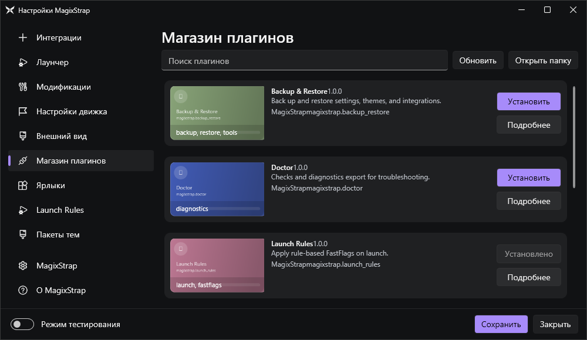

# MagixStrap

<p align="center">
  
</p>

<div align="center">


</div>

MagixStrap is a Windows bootstrapper for Roblox focused on customization, theme packs, and a modular plugin system.

## Key Features

- Modular plugins: install plugins from GitHub releases
- Theme packs for the MagixStrap UI (not Roblox)
- Launch rules: rule-based FastFlags on launch
- Doctor: diagnostics and log collection
- Backup & Restore: backup MagixStrap data to a zip and restore it later

## Plugin Store

The Plugin Store is built into Settings and supports installing plugins from GitHub releases.

<p>
  
</p>

## Building

Requirements:
- Windows 10/11
- .NET SDK 6.0

Build:
```powershell
dotnet build .\MagixStrap.sln -c Release
```

Publish a single-file `MagixStrap.exe`:
```powershell
pwsh -NoProfile -ExecutionPolicy Bypass -File .\Scripts\build-release.ps1 -Runtime x64
```

Output:
- `.\artifacts\MagixStrap-win-x64-singlefile\MagixStrap.exe`

## Plugin Catalog Source

MagixStrap can load the plugin catalog from a remote GitHub raw JSON (with cache + offline fallback).

Default remote catalog:
```text
https://raw.githubusercontent.com/magixstrap/plugin-catalog/main/plugins.json
```

Local fallback in this repo:
- `.\MagixStrap\Plugins\Catalog\plugins.json`

## Publishing Plugins (for the Store)

MagixStrap installs plugins from the latest GitHub Release assets.

What to upload to Releases:
- A `.zip` asset containing:
  - `plugin.json`
  - your plugin `*.dll` (and any dependencies/resources)

Do not upload an `.exe` as the plugin entry point. Plugins are loaded as `.dll`.

## Docs

- User/Developer guide: `.\GUIDE.md`
- Core app code: `.\MagixStrap\`
- Example plugins: `.\Plugins\`

## License

See `.\LICENSE`.

